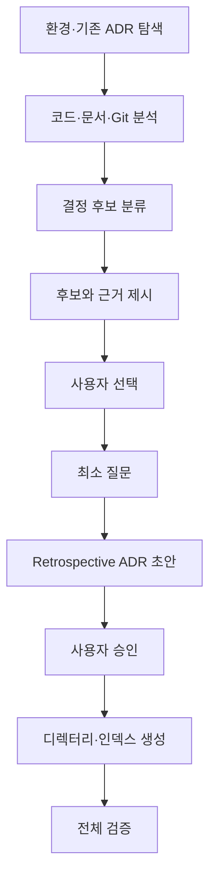
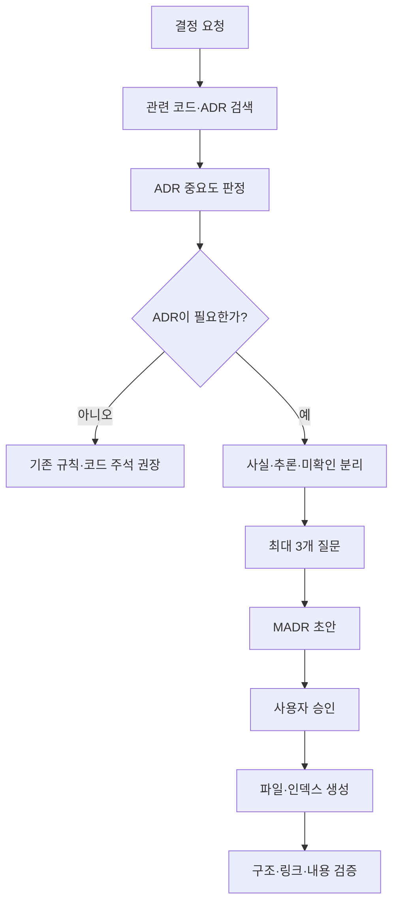
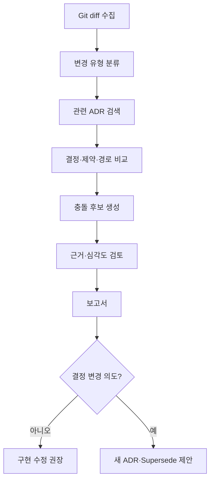
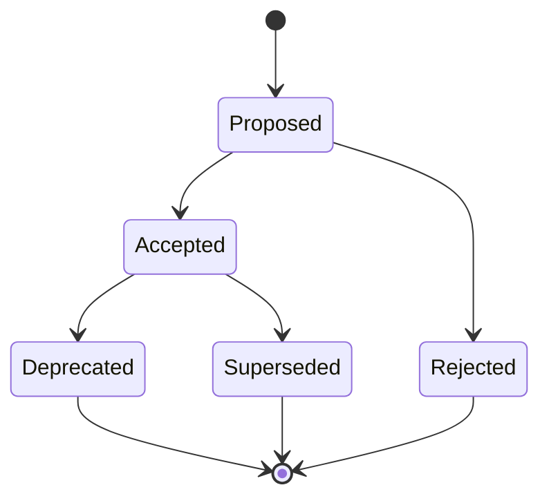

# ADR Toolkit Product Requirements Document

## 0. 문서 정보

- 제품명: ADR Toolkit
- 저장소명: `adr-toolkit`
- 문서 상태: Draft v0.1
- 제품 유형: 오픈소스 Agent Skill Toolkit + Claude Code/Codex Plugin
- 기본 형식: MADR 4.x 호환 Markdown
- 대상 릴리스: MVP 0.1.0

---

## 1. Executive Summary

### 1.1 한 줄 정의

ADR Toolkit은 코드, Git 변경 사항, 기존 ADR을 먼저 분석하고 코드만으로 알 수 없는 설계 근거만 사용자에게 질문하여 Architecture Decision Record를 작성하며, 이후 구현이 기존 결정을 준수하는지 검사하는 멀티 하네스용 AI Agent Toolkit이다.

### 1.2 문제

일반적인 ADR 도구는 사용자가 이미 다음 내용을 알고 있다는 전제에서 출발한다.

- 어떤 결정이 ADR로 기록할 가치가 있는가
- 왜 해당 결정을 내렸는가
- 어떤 대안을 검토했는가
- 기존 ADR과 충돌하지 않는가
- 결정이 실제 코드의 어느 부분에 적용되는가

실제 프로젝트에서는 결정이 코드, Pull Request, 회의와 채팅에 분산된다. 기존 CLI는 템플릿과 번호를 제공하지만 결정 후보를 발견하거나 코드와 결정의 의미적 충돌을 판단하지 못한다.

### 1.3 해결 방식

```text
Repository + Git Diff + Existing ADRs
                  ↓
         Evidence Collection
                  ↓
      Decision Significance Check
                  ↓
        Ask Only What Is Missing
                  ↓
        Human-approved MADR
                  ↓
       Continuous Decision Check
```

### 1.4 제품 포지셔닝

ADR Toolkit은 새로운 ADR 표준, 전용 Viewer 또는 단순 파일 생성 CLI가 아니다.

> 기존 ADR 생태계 위에서 동작하는 Agent-native reasoning and workflow layer

MADR, Nygard ADR, adr-tools와 Markdown lint를 가능한 한 재사용하고 다음에 집중한다.

- ADR 필요성 판별
- 코드 기반 사전 조사
- 최소 사용자 인터뷰
- 기존 결정과의 충돌 검사
- 코드와 ADR 사이의 추적성
- 여러 AI 하네스에서 동일한 Workflow 제공

---

## 2. 제품 비전

### 2.1 장기 비전

중요한 코드 변경이 관련 설계 결정의 맥락 안에서 이루어지고, 사람과 AI Agent가 동일한 Decision Log를 읽으며, 결정의 생성·실현·재검토·대체 과정이 코드와 함께 버전 관리되는 개발 환경을 만든다.

### 2.2 MVP 비전

사용자가 하나의 Skill을 설치하면 다음 세 작업을 안정적으로 수행한다.

```text
INIT   프로젝트에 ADR 체계 도입
RECORD 새로운 결정을 조사하고 기록
CHECK  코드 변경과 기존 결정의 충돌 검사
```

### 2.3 제품 메시지

영문:

> An agent-native toolkit for capturing and checking architecture decisions in the coding workflow.

한국어:

> 코드를 먼저 읽고 사람에게 결정 이유만 물어, 설계 결정을 기록하고 이후 구현까지 확인하는 AI Agent용 ADR Toolkit.

보조 메시지:

> Ask only what the code cannot tell us.

---

## 3. 목표와 비목표

### 3.1 목표

1. 기존 프로젝트에 ADR 체계를 10분 이내 도입한다.
2. 코드와 문서를 분석해 과거 또는 신규 ADR 후보를 발견한다.
3. 코드로 확인할 수 없는 설계 의도만 질문한다.
4. MADR 호환 형식으로 구조화된 ADR을 작성한다.
5. 사용자의 승인 이후에만 ADR을 Accepted로 만든다.
6. ADR을 코드 경로 및 관련 결정과 연결한다.
7. Git diff가 기존 결정과 충돌하는지 근거와 함께 검사한다.
8. Claude Code, Codex와 범용 Agent Skills에서 핵심 Workflow를 동일하게 제공한다.
9. 번호·링크·상태·인덱스 같은 결정적 처리는 스크립트로 검증한다.
10. 설치된 Skill 폴더 하나가 독립적으로 작동하도록 패키징한다.

### 3.2 비목표

1. 새로운 ADR 표준을 만들지 않는다.
2. 웹 UI나 SaaS를 MVP에서 만들지 않는다.
3. C4, arc42, UML 생성을 포함하지 않는다.
4. 코드 변경을 자동으로 차단하거나 되돌리지 않는다.
5. 사람의 승인 없이 ADR을 Accepted로 만들지 않는다.
6. 모든 기술 의존성을 ADR로 기록하지 않는다.
7. 전체 아키텍처의 완전한 역공학을 목표로 하지 않는다.
8. 모든 언어의 정밀 AST 분석을 구현하지 않는다.
9. Hook에 핵심 기능을 의존시키지 않는다.
10. 기존 ADR 본문을 자동으로 덮어쓰지 않는다.

---

## 4. 핵심 제품 원칙

### 4.1 Ask-after-Inspect

질문 전에 코드, 설정, README, 기존 ADR과 Git diff를 조사한다. 코드에서 확인된 사실을 다시 묻지 않는다.

### 4.2 Human-owned Decisions

Agent는 후보를 발견하고 질문하고 초안을 작성할 수 있지만 결정의 승인자는 사람이다.

### 4.3 Evidence before Inference

각 판단은 가능한 경우 코드 경로, 설정, 의존성 또는 기존 ADR을 근거로 제시한다. 근거 없이 추정한 과거 결정은 retrospective 후보로 취급한다.

### 4.4 Minimal Useful ADR

모든 ADR을 Full MADR로 작성하지 않는다. 단순한 결정에는 Minimal MADR, 대안과 품질 속성 비교가 중요한 경우에는 Full MADR을 사용한다.

### 4.5 Deterministic Core, Agentic Edge

- 의미 판단과 인터뷰: Agent Skill
- 파일 생성과 검증: deterministic script
- 세션 알림: harness-specific Hook
- 설치와 노출: harness adapter

### 4.6 Harness-agnostic Core

Claude 전용 Hook이나 환경변수가 없어도 INIT·RECORD·CHECK가 동작해야 한다.

### 4.7 No Silent Mutation

ADR 생성, 상태 변경, Supersede와 기존 파일 수정은 변경 계획을 사용자에게 보여준 뒤 수행한다.

---

## 5. 대상 사용자

### 5.1 개인 프로젝트 개발자

- 설계 결정을 혼자 내리지만 몇 주 후 이유를 잊는다.
- Codex와 Claude Code 같은 Agent를 자주 전환한다.
- 무거운 아키텍처 문서는 유지하기 어렵다.

### 5.2 소규모 개발팀

- PR과 메신저에 결정이 흩어져 있다.
- 신규 구성원이 기술 선택의 배경을 알기 어렵다.
- 중요한 결정만 코드와 함께 남기고 싶다.

### 5.3 Agent 중심 개발팀

- 여러 Agent가 같은 저장소를 수정한다.
- Agent가 기존 결정과 다른 패턴을 만들 수 있다.
- ADR을 Agent가 실행 가능한 제약으로 사용하고 싶다.

### 5.4 MVP 비대상

- 중앙 승인 거버넌스가 핵심인 대규모 EA 조직
- 코드 저장소 없이 중앙 문서 포털만 사용하는 조직
- 규제 산업의 완전한 승인·감사 Workflow

---

## 6. 사용자 인터페이스

### 6.1 단일 상위 Skill

```text
/adr-toolkit init
/adr-toolkit record Kafka 도입 결정을 기록해줘
/adr-toolkit check
/adr-toolkit check --since develop
```

Codex 계열에서는 호스트 표면에 따라 다음처럼 호출한다.

```text
$adr-toolkit init
$adr-toolkit record "Use Knowledge Pack instead of RAG"
$adr-toolkit check
```

### 6.2 자연어 Router

| 사용자 요청 | 모드 |
|---|---|
| 이 프로젝트에 ADR을 도입해줘 | INIT |
| Kafka를 사용한 이유를 남겨줘 | RECORD |
| 최근 코드가 기존 ADR을 지키는지 확인해줘 | CHECK |
| ADR-0003이 아직 유효한지 봐줘 | CHECK + Review |
| MongoDB로 바꾸려는데 기록해줘 | RECORD + Supersede 검사 |

### 6.3 공통 출력 순서

1. 발견한 사실
2. 판단과 신뢰도
3. 필요한 질문 또는 변경 계획
4. 생성·수정할 파일
5. 검증 결과
6. 남은 불확실성

---

## 7. INIT Workflow

### 7.1 목적

ADR이 없는 프로젝트에 기본 구조를 만들고, 코드에서 확인되는 중요한 과거 결정 후보를 사용자와 함께 선택적으로 복원한다.

### 7.2 흐름



### 7.3 탐색 대상

- `docs/adr/`, `docs/decisions/`, `adr/`, `decisions/`
- README, CONTRIBUTING, AGENTS.md, CLAUDE.md
- Maven, Gradle, npm, Python과 Go 의존성 파일
- Docker, Compose, Kubernetes와 Terraform 파일
- 애플리케이션 진입점
- DB, Queue, Cache와 외부 API
- Git log와 최근 주요 변경
- 코드 주석의 ADR 또는 decision 참조

### 7.4 후보 분류

| 등급 | 의미 | 기본 동작 |
|---|---|---|
| High | 구조·품질·운영에 장기 영향 | ADR 후보로 제시 |
| Medium | 팀 공통 패턴이나 되돌림 비용 존재 | 선택적으로 제시 |
| Low | 구현 또는 스타일 수준 | 후보에서 제외 |

### 7.5 과거 결정 복원 정책

- 사용자 확인 전 Accepted 금지
- 선택하지 않은 대안을 Agent가 임의로 확정하지 않음
- 추정한 내용은 명시적으로 표시
- 결정 시점을 모르면 현재 날짜와 retrospective 메타데이터 사용
- Git 이력이 근거이면 관련 commit 기록

### 7.6 INIT 결과

```text
docs/decisions/
├── README.md
├── adr-template.md
└── 0001-record-architecture-decisions.md
```

과거 결정을 복원하기로 선택한 경우에만 추가 ADR을 생성한다.

---

## 8. RECORD Workflow

### 8.1 목적

새로운 설계 결정을 관련 코드와 기존 결정의 맥락 속에서 조사하고 사용자의 승인을 받아 MADR로 기록한다.

### 8.2 흐름



### 8.3 ADR 중요도 판정

다음을 각각 0~2점으로 평가한다.

- 되돌리는 비용이 큰가?
- 여러 현실적인 대안이 존재했는가?
- 품질 속성에 의미 있는 영향을 주는가?
- 시스템 경계나 공통 패턴을 바꾸는가?
- 여러 개발자와 Agent가 앞으로 따라야 하는가?
- 운영, 보안, 데이터 일관성에 영향을 주는가?
- 미래에 선택 이유를 다시 물을 가능성이 큰가?

권장 해석:

```text
0~3   ADR 불필요
4~6   선택적 ADR
7~14  ADR 권장
```

점수는 최종 진리가 아니라 Agent가 근거를 설명하는 보조 수단이다.

### 8.4 질문 정책

한 라운드에 최대 3개만 질문한다.

우선순위:

1. 해결하려는 문제와 제약
2. 검토한 현실적인 대안
3. 선택 이유와 품질 목표
4. 감수하기로 한 부정적 결과
5. 재검토 조건

질문하지 않는 항목:

- 코드에서 확인되는 라이브러리명과 버전
- 기존 ADR에 명시된 공통 정책
- 파일 결과에 영향을 주지 않는 취향
- 사용자가 요청에서 이미 밝힌 내용

### 8.5 승인 Gate

파일 생성 전에 다음 요약을 보여준다.

```text
Title: Use Kafka for asynchronous domain events
Problem: 주문 처리와 후속 작업의 강한 동기 결합
Options: synchronous HTTP, RabbitMQ, Kafka
Decision: Kafka
Primary driver: 장애 격리와 이벤트 재처리
Accepted downside: 운영 복잡성, 중복 처리 대응
Affected paths: src/events/, src/order/, deploy/kafka/
Related ADRs: ADR-0002
```

사용자가 수정하거나 승인한 뒤 파일을 생성한다.

### 8.6 Template 선택

Minimal MADR:

- 선택이 단순함
- 후보가 2개 이하
- 복잡한 장단점 표가 불필요
- 소규모 프로젝트

Full MADR:

- 대안이 3개 이상
- 품질 속성 간 충돌 존재
- 여러 팀 또는 시스템에 영향
- 부정적 결과와 재검토 조건이 중요

---

## 9. CHECK Workflow

### 9.1 목적

현재 코드 또는 Git diff가 기존 Accepted ADR을 위반하거나 재검토를 요구하는지 검사한다.

### 9.2 흐름



### 9.3 검사 범위

- uncommitted diff
- staged diff
- 특정 branch 또는 commit 이후 변경
- 로컬에 제공된 Pull Request diff
- 사용자 지정 파일 집합

### 9.4 충돌 유형

| 유형 | 예시 |
|---|---|
| Direct violation | Provider Port만 쓰기로 했으나 SDK 직접 호출 |
| Pattern divergence | 공통 오류 처리 결정과 다른 패턴 추가 |
| Dependency conflict | 폐기한 기술을 다시 도입 |
| Boundary violation | 결정된 레이어 경계를 역방향 참조 |
| Missing realization | ADR이 요구한 구현 또는 테스트 누락 |
| Revisit trigger | 규모가 재검토 임계값에 도달 |
| Superseded reference | 대체된 ADR을 새 코드가 참조 |
| New decision candidate | 기존 ADR 범위를 넘는 구조적 변경 |

### 9.5 심각도

- Critical: 보안·데이터 무결성 결정 또는 명시적 금지 위반
- Major: Accepted ADR의 핵심 Decision과 구조적 충돌
- Minor: 구현 누락, 링크, 범위 또는 용어 불일치
- Info: ADR 후보 또는 재검토 권장

### 9.6 Finding 형식

```text
Severity: Major
ADR: 0003-use-provider-port.md
Decision: 외부 LLM SDK 호출은 Provider Adapter 내부로 제한한다.
Evidence: src/features/blog/openai-client.ts:12
Change: Feature 코드가 OpenAI SDK를 직접 import한다.
Confidence: High
Recommended action:
1. 기존 Provider Port를 사용한다.
2. 의도적인 구조 변경이면 ADR-0003을 Supersede한다.
```

### 9.7 자동 수정 정책

CHECK는 코드나 ADR 본문을 자동 수정하지 않는다. 다음 기계적 오류만 변경 계획 승인 후 자동 수정할 수 있다.

- 깨진 ADR 인덱스
- 존재하지 않는 내부 링크
- 명백한 파일명·ID 불일치
- Markdown formatting

---

## 10. ADR 상태와 생명주기

### 10.1 상태

- Proposed
- Accepted
- Rejected
- Deprecated
- Superseded

추가 메타데이터:

- `retrospective`
- `supersedes`
- `superseded_by`
- `related`

### 10.2 상태 전이



### 10.3 규칙

- Proposed → Accepted: 사용자 승인 필요
- Accepted → Superseded: 대체 ADR ID 필요
- Accepted → Deprecated: 이유 필요
- Rejected: 검토한 대안과 거절 이유 보존
- ADR 삭제는 기본적으로 금지하고 상태 변경 사용

---

## 11. ADR 문서 모델

### 11.1 권장 디렉터리

기존 관례가 있으면 유지한다. 없으면 다음을 기본으로 한다.

```text
docs/decisions/
├── README.md
├── adr-template.md
├── 0001-record-architecture-decisions.md
├── 0002-use-postgresql.md
└── 0003-use-provider-port.md
```

### 11.2 파일명

```text
NNNN-kebab-case-title.md
```

- 4자리 zero padding
- 기존 규칙 우선
- 사용된 ID 재사용 금지
- Superseded ADR도 유지

### 11.3 YAML Frontmatter

```yaml
---
id: ADR-0003
title: Use a provider port for LLM integrations
status: accepted
date: 2026-08-29
decision_makers:
  - Yangseunghyeon
related:
  - ADR-0001
affected_paths:
  - src/providers/
  - src/core/ports/
tags:
  - architecture
  - llm
retrospective: false
---
```

Frontmatter는 Agent와 검증 스크립트의 상호운용성을 위한 최소 메타데이터이며 MADR 본문을 대체하지 않는다.

### 11.4 Minimal Template

```md
# {title}

## Context and Problem Statement

{problem and constraints}

## Considered Options

* {option one}
* {option two}

## Decision Outcome

Chosen option: **{chosen option}**, because {rationale}.

## Consequences

* Good: {positive consequence}
* Bad: {negative consequence}

## Confirmation

{how implementation will be verified}

## Revisit Triggers

* {condition that should reopen the decision}
```

### 11.5 Agent 확장 섹션

```md
## Affected Code

* `src/providers/`
* `src/core/ports/llm-provider.ts`

## Implementation Constraints

* Feature modules must not import provider SDKs directly.

## Verification

* [ ] Static search finds no provider SDK imports outside adapters.
* [ ] Contract tests pass for every provider implementation.
```

---

## 12. 제품 아키텍처

```text
ADR Toolkit
├── Agent Workflow Layer
│   ├── Router
│   ├── Significance Judge
│   ├── Interview Planner
│   ├── ADR Drafter
│   └── Conflict Reviewer
├── Deterministic Script Layer
│   ├── Discovery
│   ├── File Operations
│   ├── Index Builder
│   ├── Schema Validator
│   └── Git Diff Collector
├── Harness Adapter Layer
│   ├── Claude Plugin
│   ├── Codex Plugin
│   └── Generic Agent Skills
└── Optional Automation Layer
    ├── Session Hook
    └── CI Check
```

### 12.1 책임 분리

| 작업 | 담당 |
|---|---|
| 요청 모드 분류 | Skill |
| ADR 중요도 판단 | Skill |
| 사용자 질문 생성 | Skill |
| 관련 결정 의미 분석 | Skill |
| 다음 ADR 번호 계산 | Script |
| 파일·인덱스 생성 | Script |
| Git diff 수집 | Script |
| Frontmatter·링크 검증 | Script |
| 세션 시작 알림 | Hook |
| PR 품질 검사 | CI + Skill/Script |

LLM 없이 가능한 처리를 LLM에게 맡기지 않고, 의미적 판단을 정규식으로 흉내 내지 않는다.

---

## 13. 저장소와 패키지 구조

```text
adr-toolkit/
├── skills/
│   └── adr-toolkit/
│       ├── SKILL.md
│       ├── scripts/
│       │   ├── adr.py
│       │   ├── discover.py
│       │   ├── create.py
│       │   ├── index.py
│       │   ├── validate.py
│       │   ├── git_diff.py
│       │   └── check.py
│       ├── templates/
│       │   ├── madr-minimal.md
│       │   └── madr-full.md
│       ├── references/
│       │   ├── significance-rules.md
│       │   ├── interview-guide.md
│       │   ├── conflict-rules.md
│       │   ├── lifecycle.md
│       │   └── madr-guide.md
│       └── schemas/
│           └── adr.schema.json
├── hooks/
│   ├── hooks.json
│   └── session-start.py
├── .claude-plugin/
│   ├── plugin.json
│   └── marketplace.json
├── .codex-plugin/
│   └── plugin.json
├── .agents/
│   ├── skills/
│   │   └── adr-toolkit -> ../../skills/adr-toolkit
│   └── plugins/
│       └── marketplace.json
├── tests/
│   ├── unit/
│   ├── behavioral/
│   ├── fixtures/
│   └── golden/
├── AGENTS.md
├── CLAUDE.md
├── README.md
├── CHANGELOG.md
├── LICENSE
└── .github/workflows/
    ├── test.yml
    └── release.yml
```

### 13.1 자기완결적 Skill

`skills/adr-toolkit/` 하나를 복사해도 다음이 동작해야 한다.

- SKILL.md Workflow
- 템플릿 로딩
- 참조 규칙 로딩
- Python 스크립트 실행
- Schema 검증

Hook, Plugin manifest와 테스트는 설치 표면과 개발 편의를 위한 부가 요소다.

### 13.2 경로 해석

Claude 전용 환경변수를 사용하지 않는다. Agent가 읽은 SKILL.md의 실제 위치를 기준으로 형제 scripts, templates와 references를 찾는다.

---

## 14. SKILL.md 계약

### 14.1 Frontmatter

```yaml
---
name: adr-toolkit
description: >
  Initialize, record, and check Architecture Decision Records by
  inspecting the repository and existing decisions before asking questions.
user-invocable: true
version: 0.1.0
---
```

### 14.2 공통 Workflow

```text
PREFLIGHT
→ DISCOVER
→ CLASSIFY
→ ASK-IF-NEEDED
→ PLAN
→ CONFIRM
→ MUTATE
→ VALIDATE
→ REPORT
```

### 14.3 금지 사항

- 기존 ADR을 읽기 전에 새 ADR 생성
- 다음 ID를 Agent가 추측
- 승인 없이 Accepted 상태 생성
- 존재하지 않는 대안을 사실처럼 기록
- 관련 코드 경로를 검사하지 않고 발명
- Hook이 없다는 이유로 핵심 동작 중단
- 하네스별 명령을 공통 로직에 하드코딩

---

## 15. Script 인터페이스

### 15.1 통합 진입점

```bash
python scripts/adr.py preflight --json
python scripts/adr.py discover --json
python scripts/adr.py init --dir docs/decisions
python scripts/adr.py next-id --json
python scripts/adr.py create --input draft.json
python scripts/adr.py index
python scripts/adr.py validate --json
python scripts/adr.py diff --since develop --json
python scripts/adr.py related --paths src/providers --json
```

### 15.2 JSON 출력

성공:

```json
{
  "ok": true,
  "operation": "discover",
  "adr_directory": "docs/decisions",
  "count": 4,
  "accepted": 3,
  "proposed": 1,
  "warnings": []
}
```

실패:

```json
{
  "ok": false,
  "operation": "validate",
  "errors": [
    {
      "code": "DUPLICATE_ADR_ID",
      "files": ["0003-a.md", "0003-b.md"]
    }
  ]
}
```

### 15.3 Python 정책

- 표준 라이브러리 우선
- macOS, Linux와 Windows 지원
- UTF-8 명시
- 덮어쓰기 전 충돌 검사
- `--dry-run` 지원
- shell option injection 방지
- stdout의 JSON과 stderr의 로그 분리

---

## 16. Hook 전략

### 16.1 목적

Hook은 판단과 문서 작성 엔진이 아니라 ADR 존재와 검토 필요성을 Agent에게 알려주는 보조 트리거다.

### 16.2 SessionStart

```text
ADR Toolkit: 5 accepted, 1 proposed; last check 12 commits ago.
```

중요한 변경 전 기존 ADR을 읽도록 짧게 안내한다.

### 16.3 Post-task 또는 Stop

하네스가 지원하면 변경 파일을 가볍게 확인한다.

```text
ADR review suggested: new dependency and worker entry point detected.
Run /adr-toolkit check for a full review.
```

### 16.4 안전 경계

Hook은 다음을 하지 않는다.

- ADR 생성 또는 Accepted 처리
- 기존 ADR 수정
- 자동 commit 또는 push
- 네트워크 LLM 호출
- 매 세션 전체 저장소 스캔
- 명시적 설정 없이 개발 차단

### 16.5 호환성

Hook은 지원되는 하네스에서만 활성화한다. Hook이 없어도 Skill과 Script는 동일하게 동작한다.

---

## 17. Claude Code·Codex·범용 Workflow

### 17.1 Canonical Source

Skill의 유일한 원본:

```text
skills/adr-toolkit/
```

Claude와 Codex 폴더에 SKILL.md를 복제하지 않는다.

### 17.2 Claude Code

- `.claude-plugin/plugin.json`에서 Skill과 선택적 Hook 노출
- local marketplace manifest 제공
- `/adr-toolkit` 호출
- 지원 시 SessionStart Hook

### 17.3 Codex

- `.codex-plugin/plugin.json`의 skills 경로가 `./skills/`를 가리킴
- 호스트가 제공하는 Skill 호출 표면 사용
- Hook 없이 INIT·RECORD·CHECK 완전 동작

### 17.4 Generic Agent Skills

- `skills/adr-toolkit/`를 배포 단위로 사용
- `.agents/skills/` 또는 설치 도구가 복사할 수 있게 구성
- AGENTS.md는 저장소 개발 규칙과 기여 안내에 사용

### 17.5 호환성 표

| 기능 | 공통 | Claude 전용 | Codex 전용 |
|---|---:|---:|---:|
| INIT·RECORD·CHECK | O |  |  |
| 템플릿·스크립트 | O |  |  |
| Session Hook |  | O | 지원 시 Adapter |
| Plugin manifest |  | O | O |
| Fixture 테스트 | O |  |  |

---

## 18. 기능 요구사항

### FR-01 Preflight

Python, Git, ADR 디렉터리와 기존 규칙을 확인한다.

### FR-02 Existing Convention Detection

기존 ADR 위치, 파일명, 템플릿과 상태 표현이 있으면 기본값보다 우선한다.

### FR-03 ADR Initialization

ADR이 없으면 디렉터리, 템플릿, Decision Log와 ADR 도입 결정 문서를 생성한다.

### FR-04 Decision Candidate Discovery

코드, 문서, 의존성과 Git 이력에서 중요한 결정 후보와 근거를 제시한다.

### FR-05 Significance Classification

후보를 High, Medium, Low로 분류하고 근거를 설명한다.

### FR-06 Minimal Interview

코드에서 확인할 수 없는 정보만 질문하고 한 라운드에 3개를 넘기지 않는다.

### FR-07 Template Selection

결정 복잡도에 따라 Minimal 또는 Full MADR을 선택한다.

### FR-08 Draft Gate

파일 생성 전 제목, 문제, 대안, 선택, 결과와 영향 경로를 사용자에게 확인받는다.

### FR-09 Lifecycle Management

Proposed, Accepted, Rejected, Deprecated와 Superseded 상태를 관리한다.

### FR-10 Index Management

ADR 생성이나 상태 변경 후 Decision Log를 갱신하고 링크를 검증한다.

### FR-11 Related ADR Search

제목, 태그, affected paths와 본문을 이용해 관련 ADR 후보를 찾는다.

### FR-12 Git Diff Collection

Uncommitted, staged, branch 또는 commit 기준 diff를 구조화해 수집한다.

### FR-13 Conflict Check

변경과 Accepted ADR의 충돌 후보를 심각도, 근거와 신뢰도로 보고한다.

### FR-14 New Decision Detection

기존 ADR 위반과 새로운 결정이 필요한 구조 변경을 구분한다.

### FR-15 Revisit Trigger Check

현재 변경이 ADR의 재검토 조건을 충족할 가능성이 있으면 표시한다.

### FR-16 Validation

ID, 파일명, Frontmatter, 필수 섹션, 링크, 상태 관계와 인덱스를 검사한다.

### FR-17 Dry Run

모든 파일 변경은 미리보기를 제공한다.

### FR-18 Machine-readable Output

핵심 스크립트는 JSON 출력을 지원한다.

### FR-19 Cross-harness Behavior

같은 Fixture에서 Claude와 Codex가 같은 Workflow 단계와 파일 구조를 사용한다.

### FR-20 Safe Failure

결정 이유가 확인되지 않으면 생성을 중단하고 필요한 정보를 요청한다.

---

## 19. 비기능 요구사항

### 19.1 정확성

- ADR 후보의 주요 주장에는 최소 하나의 근거 필요
- 존재하지 않는 경로나 ADR ID 생성 금지
- 코드만으로 결정 이유 확정 금지

### 19.2 재현성

- 동일 ADR 집합에서 ID, index와 validate 결과 동일
- 정렬과 출력 순서 안정화

### 19.3 성능

- Preflight 목표 1초 이내
- ADR 탐색·검증 목표 3초 이내
- CHECK는 전체 저장소보다 diff와 관련 경로 우선

### 19.4 보안

- secret 내용을 ADR에 포함하지 않음
- Hook에서 네트워크 요청 금지
- 안전한 subprocess 인자 사용
- 파일 권한과 저장소 경계 준수

### 19.5 이식성

- macOS, Linux, Windows
- 저장소 상대 경로
- Claude 전용 환경변수 비의존
- UTF-8 일관성

### 19.6 유지보수성

- Canonical Skill 하나
- manifest 버전 일치 검사
- 기능별 스크립트와 테스트 분리
- 외부 의존성 최소화

---

## 20. 테스트 전략

### 20.1 Unit

- ADR ID 계산
- 파일명 파싱
- Frontmatter 검증
- 상태 전이
- 인덱스 생성
- Git diff 파싱

### 20.2 Integration

- 빈 저장소 INIT
- 기존 MADR 저장소 인식
- Nygard 형식 보존
- RECORD 후 인덱스 갱신
- Supersede 관계 생성
- CHECK 관련 경로 탐색

### 20.3 Behavioral Skill Test

- 코드로 확인 가능한 사실을 다시 묻지 않는가
- ADR이 아닌 변경을 거절하는가
- 질문이 3개 이하인가
- 승인 전에 파일을 만들지 않는가
- 과거 결정의 이유를 발명하지 않는가

### 20.4 Cross-harness

- Claude 설치 패키지
- Codex plugin manifest
- Generic skill copy
- 경로 해석
- 동일 Fixture 결과 비교

### 20.5 Fixture

1. ADR이 없는 Java/Spring API
2. MADR이 있는 TypeScript 프로젝트
3. Nygard ADR을 사용하는 Python 프로젝트
4. 잘못된 ID와 링크가 있는 프로젝트
5. Accepted ADR을 위반하는 Git diff
6. ADR이 필요하지 않은 리팩터링 diff

### 20.6 Golden 결과

각 Fixture에 다음 정답을 둔다.

- 발견할 기존 ADR
- 제안할 ADR 후보
- 물어야 할 질문
- 묻지 말아야 할 질문
- 기대 Finding과 심각도
- 생성될 파일 구조

모든 버그 수정에는 Fixture 또는 Behavioral Test를 추가한다.

---

## 21. CI/CD와 릴리스

### 21.1 PR 검사

- Python test
- Skill frontmatter validation
- JSON Schema validation
- Plugin manifest validation
- 버전 일치 검사
- Fixture golden test
- Markdown lint
- secret scan

### 21.2 릴리스

```text
CHANGELOG 갱신
→ 버전 동기화
→ 전체 테스트
→ Git tag vX.Y.Z
→ Skill bundle 빌드
→ GitHub Release
→ 설치 검증
```

### 21.3 버전 동기화 대상

- `skills/adr-toolkit/SKILL.md`
- `.claude-plugin/plugin.json`
- `.codex-plugin/plugin.json`
- marketplace manifest

### 21.4 배포 표면

- Claude Code marketplace
- Codex plugin marketplace 또는 repo-local install
- Agent Skills compatible installer
- 수동 clone/symlink
- 선택적 `.skill` bundle

---

## 22. MVP 범위

### 22.1 포함

- 자기완결적 adr-toolkit Skill
- INIT, RECORD, CHECK Router
- 기존 ADR 규칙 탐색
- MADR Minimal·Full
- Decision Log
- ID·상태·링크·인덱스 검증
- 코드 기반 ADR 후보
- 최대 3개 질문
- Git diff 수집
- 관련 ADR 후보 검색
- 근거 기반 충돌 보고
- Claude Code Plugin
- Codex Plugin
- Generic Agent Skills
- 선택적 SessionStart Hook
- Fixture와 Behavioral Test
- GitHub Actions test/release

### 22.2 제외

- 웹 UI와 SaaS
- Pull Request 자동 댓글
- GitHub App
- 자동 코드 수정
- 자동 ADR 승인
- C4·arc42
- 고급 AST와 import graph
- 멀티레포 Decision Graph
- Vector DB
- 중앙 Decision Portal
- Slack·Jira·Notion 연동

### 22.3 성공 조건

- ADR 없는 Fixture에서 10분 이내 INIT
- 생성 ADR 구조 검증 100%
- 사용자 승인 전 파일 생성 0건
- 코드에서 확인 가능한 사실 재질문 10% 이하
- 단순 리팩터링 오탐 15% 이하
- Golden conflict 탐지율 85% 이상
- 존재하지 않는 ADR·경로 인용 0건
- Claude와 Codex에서 세 모드 동작
- Skill 폴더 단독 복사 후 테스트 통과

---

## 23. 구현 로드맵

### Phase 0: Skill-only Prototype

- `skills/adr-toolkit/SKILL.md`
- MADR Minimal
- significance rules
- interview guide
- 수동 파일 생성
- YouTube Summarizer Kit에서 실험

검증 후보:

- Ports & Adapters 채택
- Multi-LLM Provider Harness
- RAG 대신 Knowledge Pack
- QA 계약 계층 분리
- BYOK 지원

### Phase 1: Deterministic Scripts

- preflight
- discover
- next-id
- create
- index
- validate
- JSON output
- unit/integration tests

### Phase 2: CHECK

- Git diff 수집
- affected paths 연결
- related ADR 검색
- conflict rules
- Finding report
- 신규 결정 후보 구분

### Phase 3: Multi-harness Packaging

- Claude Plugin
- Codex Plugin
- Generic Agent Skills
- SessionStart Hook
- 설치 문서
- release workflow

### Phase 4: Ecosystem

MVP 성공 후 검토:

- PR review integration
- ArchUnit 연계
- ADR Graph와 Viewer
- C4 요소 연결
- arc42 Section 9 export
- 조직 Decision Catalog

---

## 24. 주요 시나리오

### 24.1 기존 프로젝트 도입

```text
사용자: 이 프로젝트에 ADR을 도입해줘.

Toolkit:
- 기존 ADR 없음
- Ports & Adapters와 Multi-LLM Provider 확인
- Knowledge Pack 구현 확인
- 세 가지 후보와 코드 근거 제시
- 선택된 후보만 이유 질문
- Retrospective MADR 초안
- 승인 후 docs/decisions 생성
```

### 24.2 새 결정 기록

```text
사용자: 작업 처리를 Redis Queue로 분리하기로 했어.

Toolkit:
- Redis 의존성과 Worker 코드 확인
- 기존 동기 처리 ADR 검색
- 도입 목적과 장애 정책 질문
- Supersede 필요성 판별
- 승인 후 새 MADR 생성
```

### 24.3 결정 위반

```text
사용자: 최근 코드가 ADR을 지키는지 봐줘.

Toolkit:
- Git diff 수집
- 관련 ADR 검색
- SDK 직접 호출과 Provider Port 결정의 충돌 발견
- ADR, 코드 경로와 변경을 함께 제시
- 기존 구조 준수 또는 새 ADR 제안
```

### 24.4 ADR 불필요

```text
사용자: AssertJ 메서드 하나를 바꿨는데 ADR로 남겨줘.

Toolkit:
- 공통 정책이나 의존성 변화가 아님을 확인
- 아키텍처적으로 중요하지 않다고 설명
- commit message 또는 code review 기록 권장
```

---

## 25. 위험과 대응

### 위험 1: 기존 도구 재구현

- MADR 기본 채택
- 파일 기능은 최소화
- 판단·질문·충돌 검사에 집중

### 위험 2: 모든 변경을 ADR로 제안

- Significance Test
- Low 후보 제외
- ADR 불필요 응답을 성공으로 취급
- False positive Fixture

### 위험 3: 과거 이유 발명

- 사실·추론·미확인 분리
- retrospective 메타데이터
- 승인 Gate
- 코드 근거와 사람 확인 분리

### 위험 4: CHECK 오탐

- Critical/Major에는 직접 근거 요구
- 신뢰도 표시
- related candidate와 confirmed conflict 구분
- 자동 차단 금지

### 위험 5: 하네스 불일치

- Canonical Skill
- Hook 비의존
- 상대 경로
- Cross-harness Fixture

### 위험 6: Skill 비대화

- SKILL.md는 Workflow와 계약만 유지
- 세부 규칙은 references
- 결정적 처리는 scripts
- 필요한 reference만 로딩

### 위험 7: 기존 ADR 훼손

- 기존 관례 우선
- dry-run
- 덮어쓰기 금지
- 수정 전 diff와 승인

---

## 26. 경쟁력과 차별화

| 기능 | 단순 ADR CLI | 일반 ADR Skill | ADR Toolkit |
|---|---:|---:|---:|
| 템플릿·ID | O | O | O |
| 코드 사전 조사 | X | 일부 | O |
| 중요도 판별 | X | 일부 | O |
| 최소 질문 | X | 일부 | O |
| 기존 관례 보존 | 일부 | 불명확 | O |
| Git diff 검사 | X | 일부 | O |
| 충돌 근거 | X | 제한적 | O |
| 결정적 검증 | O | 제한적 | O |
| Claude·Codex 패키지 | X | 일부 | O |
| Hook 안전 경계 | X | X | O |
| Behavioral Fixture | 일부 | 드묾 | O |

핵심 차별점은 ADR을 예쁘게 작성하는 것이 아니라 결정을 발견하고, 필요한 이유만 물으며, 이후 코드에서 다시 확인하는 전체 Workflow다.

---

## 27. 오픈소스 전략

### 27.1 라이선스

- 코어와 Skill: MIT 우선 검토
- MADR 원 라이선스와 attribution 확인
- 참고 문구를 복제하지 않고 규칙으로 재구성

### 27.2 기여 단위

- Significance Rule
- Conflict Rule
- Template Adapter
- Language/Framework Evidence Detector
- Harness Adapter
- Fixture와 Golden Case
- 문서와 번역

### 27.3 신뢰 형성

- 실제 Before/After 예제
- 실패 사례와 한계
- False positive 측정
- Behavioral Test 공개
- 자동 변경 diff
- Hook 동작 공개

---

## 28. 미해결 결정

구현 전 별도 ADR로 결정한다.

1. Python 표준 라이브러리만 사용할 것인가?
2. 기본 디렉터리를 `docs/decisions`로 할 것인가?
3. YAML frontmatter를 필수로 할 것인가?
4. MADR 4.x의 어떤 버전을 채택할 것인가?
5. retrospective를 상태로 둘 것인가, 메타데이터로 둘 것인가?
6. 관련 ADR 검색을 키워드 기반으로 시작할 것인가?
7. Hook을 기본 활성화할 것인가?
8. CLI를 공개할 것인가, Skill 내부 구현으로 둘 것인가?

이 결정들은 ADR Toolkit 자신의 ADR로 기록해 dogfooding한다.

---

## 29. 권장 초기 ADR

```text
ADR-0001 Adopt Architecture Decision Records
ADR-0002 Use MADR 4.x as the default template
ADR-0003 Package the product as one self-contained skill
ADR-0004 Separate agent reasoning from deterministic scripts
ADR-0005 Keep core workflows independent from hooks
ADR-0006 Maintain one canonical skill across harnesses
ADR-0007 Require human approval for accepted decisions
ADR-0008 Use Python for the portable script runtime
```

이 ADR들을 실제로 작성하면서 INIT, RECORD와 CHECK를 검증한다.

---

## 30. 최종 제품 정의

ADR Toolkit은 ADR Markdown 파일을 생성하는 또 하나의 CLI가 아니다.

```text
기존 도구:
사람이 결정과 이유를 알고 있음
→ 템플릿 생성
→ 사람이 작성

ADR Toolkit:
Agent가 코드와 기존 결정을 조사
→ 기록 가치 판별
→ 코드가 말하지 못하는 이유만 질문
→ 사람이 승인
→ 결정과 코드를 연결
→ 이후 변경에서 다시 검사
```

제품이 보장해야 하는 경험:

> 개발자는 ADR 형식과 번호 관리에 시간을 쓰지 않는다. Agent는 사람 대신 결정을 승인하지 않는다. 코드가 보여주는 사실은 자동으로 수집하고, 코드가 설명할 수 없는 이유는 사람에게 물으며, 승인된 결정은 이후 모든 Agent가 다시 읽고 지킨다.

