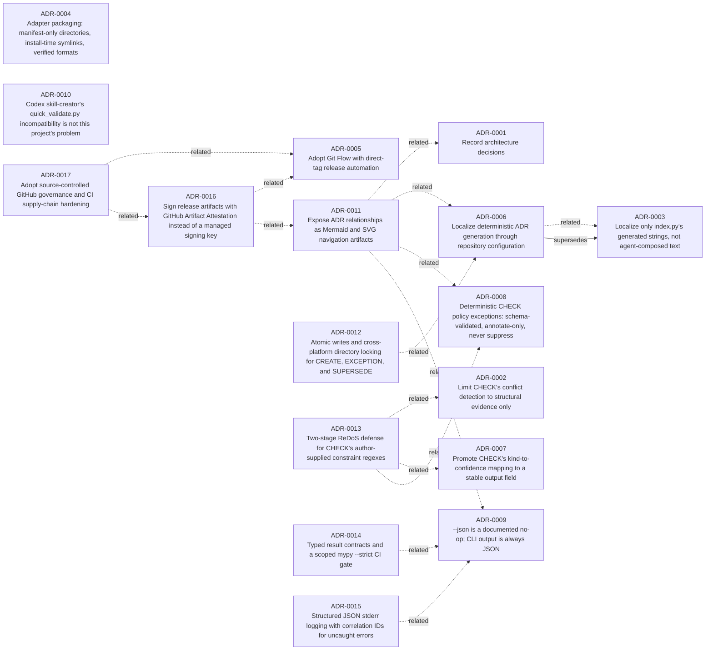

# Decision Log

## By status

### Accepted
- [ADR-0001 — Record architecture decisions](0001-record-architecture-decisions.md)
- [ADR-0002 — Limit CHECK's conflict detection to structural evidence only](0002-limit-check-s-conflict-detection-to-structural-evidence-only.md)
- [ADR-0004 — Adapter packaging: manifest-only directories, install-time symlinks, verified formats](0004-adapter-packaging-manifest-only-directories-install-time-symlinks-verified-formats.md)
- [ADR-0005 — Adopt Git Flow with direct-tag release automation](0005-adopt-git-flow-with-direct-tag-release-automation.md)
- [ADR-0006 — Localize deterministic ADR generation through repository configuration](0006-localized-adr-generation.md)
- [ADR-0007 — Promote CHECK's kind-to-confidence mapping to a stable output field](0007-check-confidence-field.md)
- [ADR-0008 — Deterministic CHECK policy exceptions: schema-validated, annotate-only, never suppress](0008-check-exceptions-annotate-only.md)
- [ADR-0009 — --json is a documented no-op; CLI output is always JSON](0009-json-flag-always-json-contract.md)
- [ADR-0010 — Codex skill-creator's quick_validate.py incompatibility is not this project's problem](0010-codex-quick-validate-not-applicable.md)
- [ADR-0011 — Expose ADR relationships as Mermaid and SVG navigation artifacts](0011-adr-relationship-graph-public-readiness.md)
- [ADR-0012 — Atomic writes and cross-platform directory locking for CREATE, EXCEPTION, and SUPERSEDE](0012-atomic-writes-and-cross-platform-directory-locking-for-create-exception-and-supersede.md)
- [ADR-0013 — Two-stage ReDoS defense for CHECK's author-supplied constraint regexes](0013-two-stage-redos-defense-for-check-s-author-supplied-constraint-regexes.md)
- [ADR-0014 — Typed result contracts and a scoped mypy --strict CI gate](0014-typed-result-contracts-and-a-scoped-mypy-strict-ci-gate.md)
- [ADR-0015 — Structured JSON stderr logging with correlation IDs for uncaught errors](0015-structured-json-stderr-logging-with-correlation-ids-for-uncaught-errors.md)
- [ADR-0016 — Sign release artifacts with GitHub Artifact Attestation instead of a managed signing key](0016-sign-release-artifacts-with-github-artifact-attestation-instead-of-a-managed-signing-key.md)
- [ADR-0017 — Adopt source-controlled GitHub governance and CI supply-chain hardening](0017-adopt-source-controlled-github-governance-and-ci-supply-chain-hardening.md)

### Superseded
- [ADR-0003 — Localize only index.py's generated strings, not agent-composed text](0003-localize-only-index-py-s-generated-strings-not-agent-composed-text.md)

## By tag

### adapters
- [ADR-0004 — Adapter packaging: manifest-only directories, install-time symlinks, verified formats](0004-adapter-packaging-manifest-only-directories-install-time-symlinks-verified-formats.md)

### architecture
- [ADR-0002 — Limit CHECK's conflict detection to structural evidence only](0002-limit-check-s-conflict-detection-to-structural-evidence-only.md)
- [ADR-0003 — Localize only index.py's generated strings, not agent-composed text](0003-localize-only-index-py-s-generated-strings-not-agent-composed-text.md)
- [ADR-0006 — Localize deterministic ADR generation through repository configuration](0006-localized-adr-generation.md)

### check
- [ADR-0002 — Limit CHECK's conflict detection to structural evidence only](0002-limit-check-s-conflict-detection-to-structural-evidence-only.md)
- [ADR-0007 — Promote CHECK's kind-to-confidence mapping to a stable output field](0007-check-confidence-field.md)
- [ADR-0008 — Deterministic CHECK policy exceptions: schema-validated, annotate-only, never suppress](0008-check-exceptions-annotate-only.md)
- [ADR-0013 — Two-stage ReDoS defense for CHECK's author-supplied constraint regexes](0013-two-stage-redos-defense-for-check-s-author-supplied-constraint-regexes.md)

### ci
- [ADR-0017 — Adopt source-controlled GitHub governance and CI supply-chain hardening](0017-adopt-source-controlled-github-governance-and-ci-supply-chain-hardening.md)

### cli
- [ADR-0009 — --json is a documented no-op; CLI output is always JSON](0009-json-flag-always-json-contract.md)

### codex
- [ADR-0010 — Codex skill-creator's quick_validate.py incompatibility is not this project's problem](0010-codex-quick-validate-not-applicable.md)

### concurrency
- [ADR-0012 — Atomic writes and cross-platform directory locking for CREATE, EXCEPTION, and SUPERSEDE](0012-atomic-writes-and-cross-platform-directory-locking-for-create-exception-and-supersede.md)

### confidence
- [ADR-0007 — Promote CHECK's kind-to-confidence mapping to a stable output field](0007-check-confidence-field.md)

### configuration
- [ADR-0006 — Localize deterministic ADR generation through repository configuration](0006-localized-adr-generation.md)

### contract
- [ADR-0014 — Typed result contracts and a scoped mypy --strict CI gate](0014-typed-result-contracts-and-a-scoped-mypy-strict-ci-gate.md)

### core
- [ADR-0012 — Atomic writes and cross-platform directory locking for CREATE, EXCEPTION, and SUPERSEDE](0012-atomic-writes-and-cross-platform-directory-locking-for-create-exception-and-supersede.md)
- [ADR-0013 — Two-stage ReDoS defense for CHECK's author-supplied constraint regexes](0013-two-stage-redos-defense-for-check-s-author-supplied-constraint-regexes.md)
- [ADR-0014 — Typed result contracts and a scoped mypy --strict CI gate](0014-typed-result-contracts-and-a-scoped-mypy-strict-ci-gate.md)
- [ADR-0015 — Structured JSON stderr logging with correlation IDs for uncaught errors](0015-structured-json-stderr-logging-with-correlation-ids-for-uncaught-errors.md)

### cross-harness
- [ADR-0010 — Codex skill-creator's quick_validate.py incompatibility is not this project's problem](0010-codex-quick-validate-not-applicable.md)

### documentation
- [ADR-0010 — Codex skill-creator's quick_validate.py incompatibility is not this project's problem](0010-codex-quick-validate-not-applicable.md)
- [ADR-0011 — Expose ADR relationships as Mermaid and SVG navigation artifacts](0011-adr-relationship-graph-public-readiness.md)

### exceptions
- [ADR-0008 — Deterministic CHECK policy exceptions: schema-validated, annotate-only, never suppress](0008-check-exceptions-annotate-only.md)

### git-flow
- [ADR-0005 — Adopt Git Flow with direct-tag release automation](0005-adopt-git-flow-with-direct-tag-release-automation.md)

### github
- [ADR-0017 — Adopt source-controlled GitHub governance and CI supply-chain hardening](0017-adopt-source-controlled-github-governance-and-ci-supply-chain-hardening.md)

### governance
- [ADR-0008 — Deterministic CHECK policy exceptions: schema-validated, annotate-only, never suppress](0008-check-exceptions-annotate-only.md)
- [ADR-0011 — Expose ADR relationships as Mermaid and SVG navigation artifacts](0011-adr-relationship-graph-public-readiness.md)
- [ADR-0017 — Adopt source-controlled GitHub governance and CI supply-chain hardening](0017-adopt-source-controlled-github-governance-and-ci-supply-chain-hardening.md)

### graph
- [ADR-0011 — Expose ADR relationships as Mermaid and SVG navigation artifacts](0011-adr-relationship-graph-public-readiness.md)

### harness-support
- [ADR-0004 — Adapter packaging: manifest-only directories, install-time symlinks, verified formats](0004-adapter-packaging-manifest-only-directories-install-time-symlinks-verified-formats.md)

### i18n
- [ADR-0003 — Localize only index.py's generated strings, not agent-composed text](0003-localize-only-index-py-s-generated-strings-not-agent-composed-text.md)
- [ADR-0006 — Localize deterministic ADR generation through repository configuration](0006-localized-adr-generation.md)

### mvp-scope
- [ADR-0002 — Limit CHECK's conflict detection to structural evidence only](0002-limit-check-s-conflict-detection-to-structural-evidence-only.md)

### navigation
- [ADR-0011 — Expose ADR relationships as Mermaid and SVG navigation artifacts](0011-adr-relationship-graph-public-readiness.md)

### observability
- [ADR-0015 — Structured JSON stderr logging with correlation IDs for uncaught errors](0015-structured-json-stderr-logging-with-correlation-ids-for-uncaught-errors.md)

### output-contract
- [ADR-0009 — --json is a documented no-op; CLI output is always JSON](0009-json-flag-always-json-contract.md)

### process
- [ADR-0001 — Record architecture decisions](0001-record-architecture-decisions.md)
- [ADR-0005 — Adopt Git Flow with direct-tag release automation](0005-adopt-git-flow-with-direct-tag-release-automation.md)

### release
- [ADR-0005 — Adopt Git Flow with direct-tag release automation](0005-adopt-git-flow-with-direct-tag-release-automation.md)
- [ADR-0016 — Sign release artifacts with GitHub Artifact Attestation instead of a managed signing key](0016-sign-release-artifacts-with-github-artifact-attestation-instead-of-a-managed-signing-key.md)

### reliability
- [ADR-0012 — Atomic writes and cross-platform directory locking for CREATE, EXCEPTION, and SUPERSEDE](0012-atomic-writes-and-cross-platform-directory-locking-for-create-exception-and-supersede.md)

### security
- [ADR-0013 — Two-stage ReDoS defense for CHECK's author-supplied constraint regexes](0013-two-stage-redos-defense-for-check-s-author-supplied-constraint-regexes.md)
- [ADR-0016 — Sign release artifacts with GitHub Artifact Attestation instead of a managed signing key](0016-sign-release-artifacts-with-github-artifact-attestation-instead-of-a-managed-signing-key.md)
- [ADR-0017 — Adopt source-controlled GitHub governance and CI supply-chain hardening](0017-adopt-source-controlled-github-governance-and-ci-supply-chain-hardening.md)

### supply-chain
- [ADR-0016 — Sign release artifacts with GitHub Artifact Attestation instead of a managed signing key](0016-sign-release-artifacts-with-github-artifact-attestation-instead-of-a-managed-signing-key.md)
- [ADR-0017 — Adopt source-controlled GitHub governance and CI supply-chain hardening](0017-adopt-source-controlled-github-governance-and-ci-supply-chain-hardening.md)

### typing
- [ADR-0014 — Typed result contracts and a scoped mypy --strict CI gate](0014-typed-result-contracts-and-a-scoped-mypy-strict-ci-gate.md)

### v0.2.0
- [ADR-0006 — Localize deterministic ADR generation through repository configuration](0006-localized-adr-generation.md)
- [ADR-0007 — Promote CHECK's kind-to-confidence mapping to a stable output field](0007-check-confidence-field.md)
- [ADR-0008 — Deterministic CHECK policy exceptions: schema-validated, annotate-only, never suppress](0008-check-exceptions-annotate-only.md)
- [ADR-0009 — --json is a documented no-op; CLI output is always JSON](0009-json-flag-always-json-contract.md)
- [ADR-0011 — Expose ADR relationships as Mermaid and SVG navigation artifacts](0011-adr-relationship-graph-public-readiness.md)

### v0.3.0
- [ADR-0012 — Atomic writes and cross-platform directory locking for CREATE, EXCEPTION, and SUPERSEDE](0012-atomic-writes-and-cross-platform-directory-locking-for-create-exception-and-supersede.md)
- [ADR-0013 — Two-stage ReDoS defense for CHECK's author-supplied constraint regexes](0013-two-stage-redos-defense-for-check-s-author-supplied-constraint-regexes.md)
- [ADR-0014 — Typed result contracts and a scoped mypy --strict CI gate](0014-typed-result-contracts-and-a-scoped-mypy-strict-ci-gate.md)
- [ADR-0015 — Structured JSON stderr logging with correlation IDs for uncaught errors](0015-structured-json-stderr-logging-with-correlation-ids-for-uncaught-errors.md)
- [ADR-0016 — Sign release artifacts with GitHub Artifact Attestation instead of a managed signing key](0016-sign-release-artifacts-with-github-artifact-attestation-instead-of-a-managed-signing-key.md)

## By affected path

### `.adr-toolkit.json`
- [ADR-0003 — Localize only index.py's generated strings, not agent-composed text](0003-localize-only-index-py-s-generated-strings-not-agent-composed-text.md)
- [ADR-0006 — Localize deterministic ADR generation through repository configuration](0006-localized-adr-generation.md)

### `.claude-plugin/marketplace.json`
- [ADR-0004 — Adapter packaging: manifest-only directories, install-time symlinks, verified formats](0004-adapter-packaging-manifest-only-directories-install-time-symlinks-verified-formats.md)

### `.claude-plugin/plugin.json`
- [ADR-0004 — Adapter packaging: manifest-only directories, install-time symlinks, verified formats](0004-adapter-packaging-manifest-only-directories-install-time-symlinks-verified-formats.md)

### `.github/CODEOWNERS`
- [ADR-0017 — Adopt source-controlled GitHub governance and CI supply-chain hardening](0017-adopt-source-controlled-github-governance-and-ci-supply-chain-hardening.md)

### `.github/ISSUE_TEMPLATE/`
- [ADR-0017 — Adopt source-controlled GitHub governance and CI supply-chain hardening](0017-adopt-source-controlled-github-governance-and-ci-supply-chain-hardening.md)

### `.github/PULL_REQUEST_TEMPLATE.md`
- [ADR-0011 — Expose ADR relationships as Mermaid and SVG navigation artifacts](0011-adr-relationship-graph-public-readiness.md)

### `.github/dependabot.yml`
- [ADR-0017 — Adopt source-controlled GitHub governance and CI supply-chain hardening](0017-adopt-source-controlled-github-governance-and-ci-supply-chain-hardening.md)

### `.github/labeler.yml`
- [ADR-0017 — Adopt source-controlled GitHub governance and CI supply-chain hardening](0017-adopt-source-controlled-github-governance-and-ci-supply-chain-hardening.md)

### `.github/labels.yml`
- [ADR-0017 — Adopt source-controlled GitHub governance and CI supply-chain hardening](0017-adopt-source-controlled-github-governance-and-ci-supply-chain-hardening.md)

### `.github/workflows/`
- [ADR-0005 — Adopt Git Flow with direct-tag release automation](0005-adopt-git-flow-with-direct-tag-release-automation.md)

### `.github/workflows/release.yml`
- [ADR-0016 — Sign release artifacts with GitHub Artifact Attestation instead of a managed signing key](0016-sign-release-artifacts-with-github-artifact-attestation-instead-of-a-managed-signing-key.md)
- [ADR-0017 — Adopt source-controlled GitHub governance and CI supply-chain hardening](0017-adopt-source-controlled-github-governance-and-ci-supply-chain-hardening.md)

### `.github/workflows/test.yml`
- [ADR-0014 — Typed result contracts and a scoped mypy --strict CI gate](0014-typed-result-contracts-and-a-scoped-mypy-strict-ci-gate.md)
- [ADR-0017 — Adopt source-controlled GitHub governance and CI supply-chain hardening](0017-adopt-source-controlled-github-governance-and-ci-supply-chain-hardening.md)

### `.gitignore`
- [ADR-0004 — Adapter packaging: manifest-only directories, install-time symlinks, verified formats](0004-adapter-packaging-manifest-only-directories-install-time-symlinks-verified-formats.md)

### `AGENTS.md`
- [ADR-0005 — Adopt Git Flow with direct-tag release automation](0005-adopt-git-flow-with-direct-tag-release-automation.md)

### `CONTRIBUTING.md`
- [ADR-0011 — Expose ADR relationships as Mermaid and SVG navigation artifacts](0011-adr-relationship-graph-public-readiness.md)

### `README.md`
- [ADR-0007 — Promote CHECK's kind-to-confidence mapping to a stable output field](0007-check-confidence-field.md)
- [ADR-0008 — Deterministic CHECK policy exceptions: schema-validated, annotate-only, never suppress](0008-check-exceptions-annotate-only.md)
- [ADR-0009 — --json is a documented no-op; CLI output is always JSON](0009-json-flag-always-json-contract.md)
- [ADR-0011 — Expose ADR relationships as Mermaid and SVG navigation artifacts](0011-adr-relationship-graph-public-readiness.md)

### `SECURITY.md`
- [ADR-0011 — Expose ADR relationships as Mermaid and SVG navigation artifacts](0011-adr-relationship-graph-public-readiness.md)
- [ADR-0016 — Sign release artifacts with GitHub Artifact Attestation instead of a managed signing key](0016-sign-release-artifacts-with-github-artifact-attestation-instead-of-a-managed-signing-key.md)
- [ADR-0017 — Adopt source-controlled GitHub governance and CI supply-chain hardening](0017-adopt-source-controlled-github-governance-and-ci-supply-chain-hardening.md)

### `adapters/`
- [ADR-0004 — Adapter packaging: manifest-only directories, install-time symlinks, verified formats](0004-adapter-packaging-manifest-only-directories-install-time-symlinks-verified-formats.md)

### `docs/decisions/`
- [ADR-0001 — Record architecture decisions](0001-record-architecture-decisions.md)

### `docs/decisions/README.md`
- [ADR-0011 — Expose ADR relationships as Mermaid and SVG navigation artifacts](0011-adr-relationship-graph-public-readiness.md)

### `docs/decisions/relationships.mmd`
- [ADR-0011 — Expose ADR relationships as Mermaid and SVG navigation artifacts](0011-adr-relationship-graph-public-readiness.md)

### `docs/decisions/relationships.svg`
- [ADR-0011 — Expose ADR relationships as Mermaid and SVG navigation artifacts](0011-adr-relationship-graph-public-readiness.md)

### `examples/quickstart.md`
- [ADR-0007 — Promote CHECK's kind-to-confidence mapping to a stable output field](0007-check-confidence-field.md)

### `project-roadmap.md`
- [ADR-0011 — Expose ADR relationships as Mermaid and SVG navigation artifacts](0011-adr-relationship-graph-public-readiness.md)

### `pyproject.toml`
- [ADR-0017 — Adopt source-controlled GitHub governance and CI supply-chain hardening](0017-adopt-source-controlled-github-governance-and-ci-supply-chain-hardening.md)

### `scripts/export_dev_requirements.py`
- [ADR-0017 — Adopt source-controlled GitHub governance and CI supply-chain hardening](0017-adopt-source-controlled-github-governance-and-ci-supply-chain-hardening.md)

### `scripts/sync_version.py`
- [ADR-0005 — Adopt Git Flow with direct-tag release automation](0005-adopt-git-flow-with-direct-tag-release-automation.md)

### `skills/adr-toolkit/SKILL.md`
- [ADR-0003 — Localize only index.py's generated strings, not agent-composed text](0003-localize-only-index-py-s-generated-strings-not-agent-composed-text.md)
- [ADR-0006 — Localize deterministic ADR generation through repository configuration](0006-localized-adr-generation.md)
- [ADR-0007 — Promote CHECK's kind-to-confidence mapping to a stable output field](0007-check-confidence-field.md)
- [ADR-0008 — Deterministic CHECK policy exceptions: schema-validated, annotate-only, never suppress](0008-check-exceptions-annotate-only.md)
- [ADR-0009 — --json is a documented no-op; CLI output is always JSON](0009-json-flag-always-json-contract.md)
- [ADR-0010 — Codex skill-creator's quick_validate.py incompatibility is not this project's problem](0010-codex-quick-validate-not-applicable.md)
- [ADR-0011 — Expose ADR relationships as Mermaid and SVG navigation artifacts](0011-adr-relationship-graph-public-readiness.md)

### `skills/adr-toolkit/VERSION`
- [ADR-0005 — Adopt Git Flow with direct-tag release automation](0005-adopt-git-flow-with-direct-tag-release-automation.md)

### `skills/adr-toolkit/references/conflict-rules.md`
- [ADR-0002 — Limit CHECK's conflict detection to structural evidence only](0002-limit-check-s-conflict-detection-to-structural-evidence-only.md)
- [ADR-0007 — Promote CHECK's kind-to-confidence mapping to a stable output field](0007-check-confidence-field.md)
- [ADR-0008 — Deterministic CHECK policy exceptions: schema-validated, annotate-only, never suppress](0008-check-exceptions-annotate-only.md)

### `skills/adr-toolkit/schemas/adr.schema.json`
- [ADR-0006 — Localize deterministic ADR generation through repository configuration](0006-localized-adr-generation.md)

### `skills/adr-toolkit/schemas/exception.schema.json`
- [ADR-0008 — Deterministic CHECK policy exceptions: schema-validated, annotate-only, never suppress](0008-check-exceptions-annotate-only.md)

### `skills/adr-toolkit/scripts/adr.py`
- [ADR-0006 — Localize deterministic ADR generation through repository configuration](0006-localized-adr-generation.md)
- [ADR-0008 — Deterministic CHECK policy exceptions: schema-validated, annotate-only, never suppress](0008-check-exceptions-annotate-only.md)
- [ADR-0009 — --json is a documented no-op; CLI output is always JSON](0009-json-flag-always-json-contract.md)
- [ADR-0011 — Expose ADR relationships as Mermaid and SVG navigation artifacts](0011-adr-relationship-graph-public-readiness.md)
- [ADR-0015 — Structured JSON stderr logging with correlation IDs for uncaught errors](0015-structured-json-stderr-logging-with-correlation-ids-for-uncaught-errors.md)

### `skills/adr-toolkit/scripts/commands/check.py`
- [ADR-0002 — Limit CHECK's conflict detection to structural evidence only](0002-limit-check-s-conflict-detection-to-structural-evidence-only.md)
- [ADR-0007 — Promote CHECK's kind-to-confidence mapping to a stable output field](0007-check-confidence-field.md)
- [ADR-0008 — Deterministic CHECK policy exceptions: schema-validated, annotate-only, never suppress](0008-check-exceptions-annotate-only.md)

### `skills/adr-toolkit/scripts/commands/create.py`
- [ADR-0003 — Localize only index.py's generated strings, not agent-composed text](0003-localize-only-index-py-s-generated-strings-not-agent-composed-text.md)
- [ADR-0006 — Localize deterministic ADR generation through repository configuration](0006-localized-adr-generation.md)
- [ADR-0012 — Atomic writes and cross-platform directory locking for CREATE, EXCEPTION, and SUPERSEDE](0012-atomic-writes-and-cross-platform-directory-locking-for-create-exception-and-supersede.md)

### `skills/adr-toolkit/scripts/commands/diff.py`
- [ADR-0002 — Limit CHECK's conflict detection to structural evidence only](0002-limit-check-s-conflict-detection-to-structural-evidence-only.md)

### `skills/adr-toolkit/scripts/commands/exception.py`
- [ADR-0008 — Deterministic CHECK policy exceptions: schema-validated, annotate-only, never suppress](0008-check-exceptions-annotate-only.md)
- [ADR-0012 — Atomic writes and cross-platform directory locking for CREATE, EXCEPTION, and SUPERSEDE](0012-atomic-writes-and-cross-platform-directory-locking-for-create-exception-and-supersede.md)

### `skills/adr-toolkit/scripts/commands/graph.py`
- [ADR-0011 — Expose ADR relationships as Mermaid and SVG navigation artifacts](0011-adr-relationship-graph-public-readiness.md)

### `skills/adr-toolkit/scripts/commands/index.py`
- [ADR-0003 — Localize only index.py's generated strings, not agent-composed text](0003-localize-only-index-py-s-generated-strings-not-agent-composed-text.md)
- [ADR-0006 — Localize deterministic ADR generation through repository configuration](0006-localized-adr-generation.md)
- [ADR-0011 — Expose ADR relationships as Mermaid and SVG navigation artifacts](0011-adr-relationship-graph-public-readiness.md)

### `skills/adr-toolkit/scripts/commands/init.py`
- [ADR-0003 — Localize only index.py's generated strings, not agent-composed text](0003-localize-only-index-py-s-generated-strings-not-agent-composed-text.md)
- [ADR-0006 — Localize deterministic ADR generation through repository configuration](0006-localized-adr-generation.md)

### `skills/adr-toolkit/scripts/commands/supersede.py`
- [ADR-0012 — Atomic writes and cross-platform directory locking for CREATE, EXCEPTION, and SUPERSEDE](0012-atomic-writes-and-cross-platform-directory-locking-for-create-exception-and-supersede.md)

### `skills/adr-toolkit/scripts/commands/validate.py`
- [ADR-0006 — Localize deterministic ADR generation through repository configuration](0006-localized-adr-generation.md)

### `skills/adr-toolkit/scripts/core/atomic_io.py`
- [ADR-0012 — Atomic writes and cross-platform directory locking for CREATE, EXCEPTION, and SUPERSEDE](0012-atomic-writes-and-cross-platform-directory-locking-for-create-exception-and-supersede.md)

### `skills/adr-toolkit/scripts/core/config.py`
- [ADR-0003 — Localize only index.py's generated strings, not agent-composed text](0003-localize-only-index-py-s-generated-strings-not-agent-composed-text.md)
- [ADR-0006 — Localize deterministic ADR generation through repository configuration](0006-localized-adr-generation.md)

### `skills/adr-toolkit/scripts/core/constraints.py`
- [ADR-0002 — Limit CHECK's conflict detection to structural evidence only](0002-limit-check-s-conflict-detection-to-structural-evidence-only.md)
- [ADR-0013 — Two-stage ReDoS defense for CHECK's author-supplied constraint regexes](0013-two-stage-redos-defense-for-check-s-author-supplied-constraint-regexes.md)

### `skills/adr-toolkit/scripts/core/contracts.py`
- [ADR-0014 — Typed result contracts and a scoped mypy --strict CI gate](0014-typed-result-contracts-and-a-scoped-mypy-strict-ci-gate.md)

### `skills/adr-toolkit/scripts/core/exceptions.py`
- [ADR-0008 — Deterministic CHECK policy exceptions: schema-validated, annotate-only, never suppress](0008-check-exceptions-annotate-only.md)

### `skills/adr-toolkit/scripts/core/identifiers.py`
- [ADR-0006 — Localize deterministic ADR generation through repository configuration](0006-localized-adr-generation.md)

### `skills/adr-toolkit/scripts/core/locale.py`
- [ADR-0003 — Localize only index.py's generated strings, not agent-composed text](0003-localize-only-index-py-s-generated-strings-not-agent-composed-text.md)
- [ADR-0006 — Localize deterministic ADR generation through repository configuration](0006-localized-adr-generation.md)

### `skills/adr-toolkit/scripts/core/relationships.py`
- [ADR-0011 — Expose ADR relationships as Mermaid and SVG navigation artifacts](0011-adr-relationship-graph-public-readiness.md)

### `skills/adr-toolkit/scripts/core/rendering.py`
- [ADR-0003 — Localize only index.py's generated strings, not agent-composed text](0003-localize-only-index-py-s-generated-strings-not-agent-composed-text.md)
- [ADR-0006 — Localize deterministic ADR generation through repository configuration](0006-localized-adr-generation.md)

### `skills/adr-toolkit/scripts/core/schema.py`
- [ADR-0006 — Localize deterministic ADR generation through repository configuration](0006-localized-adr-generation.md)

### `skills/adr-toolkit/scripts/core/telemetry.py`
- [ADR-0015 — Structured JSON stderr logging with correlation IDs for uncaught errors](0015-structured-json-stderr-logging-with-correlation-ids-for-uncaught-errors.md)

### `skills/adr-toolkit/scripts/i18n/`
- [ADR-0003 — Localize only index.py's generated strings, not agent-composed text](0003-localize-only-index-py-s-generated-strings-not-agent-composed-text.md)
- [ADR-0006 — Localize deterministic ADR generation through repository configuration](0006-localized-adr-generation.md)

### `skills/adr-toolkit/scripts/rules/conflict.py`
- [ADR-0002 — Limit CHECK's conflict detection to structural evidence only](0002-limit-check-s-conflict-detection-to-structural-evidence-only.md)
- [ADR-0013 — Two-stage ReDoS defense for CHECK's author-supplied constraint regexes](0013-two-stage-redos-defense-for-check-s-author-supplied-constraint-regexes.md)

### `tests/integration/test_cli.py`
- [ADR-0009 — --json is a documented no-op; CLI output is always JSON](0009-json-flag-always-json-contract.md)

### `tests/unit/test_adr_cli.py`
- [ADR-0011 — Expose ADR relationships as Mermaid and SVG navigation artifacts](0011-adr-relationship-graph-public-readiness.md)

### `tests/unit/test_atomic_io.py`
- [ADR-0012 — Atomic writes and cross-platform directory locking for CREATE, EXCEPTION, and SUPERSEDE](0012-atomic-writes-and-cross-platform-directory-locking-for-create-exception-and-supersede.md)

### `tests/unit/test_check.py`
- [ADR-0007 — Promote CHECK's kind-to-confidence mapping to a stable output field](0007-check-confidence-field.md)

### `tests/unit/test_conflict.py`
- [ADR-0013 — Two-stage ReDoS defense for CHECK's author-supplied constraint regexes](0013-two-stage-redos-defense-for-check-s-author-supplied-constraint-regexes.md)

### `tests/unit/test_constraints.py`
- [ADR-0013 — Two-stage ReDoS defense for CHECK's author-supplied constraint regexes](0013-two-stage-redos-defense-for-check-s-author-supplied-constraint-regexes.md)

### `tests/unit/test_contracts.py`
- [ADR-0014 — Typed result contracts and a scoped mypy --strict CI gate](0014-typed-result-contracts-and-a-scoped-mypy-strict-ci-gate.md)

### `tests/unit/test_github_governance.py`
- [ADR-0017 — Adopt source-controlled GitHub governance and CI supply-chain hardening](0017-adopt-source-controlled-github-governance-and-ci-supply-chain-hardening.md)

### `tests/unit/test_graph_command.py`
- [ADR-0011 — Expose ADR relationships as Mermaid and SVG navigation artifacts](0011-adr-relationship-graph-public-readiness.md)

### `tests/unit/test_index.py`
- [ADR-0011 — Expose ADR relationships as Mermaid and SVG navigation artifacts](0011-adr-relationship-graph-public-readiness.md)

### `tests/unit/test_relationships.py`
- [ADR-0011 — Expose ADR relationships as Mermaid and SVG navigation artifacts](0011-adr-relationship-graph-public-readiness.md)

### `tests/unit/test_telemetry.py`
- [ADR-0015 — Structured JSON stderr logging with correlation IDs for uncaught errors](0015-structured-json-stderr-logging-with-correlation-ids-for-uncaught-errors.md)

## Chronological (newest first)

- 2026-09-06 — [ADR-0017 — Adopt source-controlled GitHub governance and CI supply-chain hardening](0017-adopt-source-controlled-github-governance-and-ci-supply-chain-hardening.md)
- 2026-09-01 — [ADR-0012 — Atomic writes and cross-platform directory locking for CREATE, EXCEPTION, and SUPERSEDE](0012-atomic-writes-and-cross-platform-directory-locking-for-create-exception-and-supersede.md)
- 2026-09-01 — [ADR-0013 — Two-stage ReDoS defense for CHECK's author-supplied constraint regexes](0013-two-stage-redos-defense-for-check-s-author-supplied-constraint-regexes.md)
- 2026-09-01 — [ADR-0014 — Typed result contracts and a scoped mypy --strict CI gate](0014-typed-result-contracts-and-a-scoped-mypy-strict-ci-gate.md)
- 2026-09-01 — [ADR-0015 — Structured JSON stderr logging with correlation IDs for uncaught errors](0015-structured-json-stderr-logging-with-correlation-ids-for-uncaught-errors.md)
- 2026-09-01 — [ADR-0016 — Sign release artifacts with GitHub Artifact Attestation instead of a managed signing key](0016-sign-release-artifacts-with-github-artifact-attestation-instead-of-a-managed-signing-key.md)
- 2026-08-31 — [ADR-0011 — Expose ADR relationships as Mermaid and SVG navigation artifacts](0011-adr-relationship-graph-public-readiness.md)
- 2026-08-30 — [ADR-0001 — Record architecture decisions](0001-record-architecture-decisions.md)
- 2026-08-30 — [ADR-0002 — Limit CHECK's conflict detection to structural evidence only](0002-limit-check-s-conflict-detection-to-structural-evidence-only.md)
- 2026-08-30 — [ADR-0003 — Localize only index.py's generated strings, not agent-composed text](0003-localize-only-index-py-s-generated-strings-not-agent-composed-text.md)
- 2026-08-30 — [ADR-0004 — Adapter packaging: manifest-only directories, install-time symlinks, verified formats](0004-adapter-packaging-manifest-only-directories-install-time-symlinks-verified-formats.md)
- 2026-08-30 — [ADR-0005 — Adopt Git Flow with direct-tag release automation](0005-adopt-git-flow-with-direct-tag-release-automation.md)
- 2026-08-30 — [ADR-0006 — Localize deterministic ADR generation through repository configuration](0006-localized-adr-generation.md)
- 2026-08-30 — [ADR-0007 — Promote CHECK's kind-to-confidence mapping to a stable output field](0007-check-confidence-field.md)
- 2026-08-30 — [ADR-0008 — Deterministic CHECK policy exceptions: schema-validated, annotate-only, never suppress](0008-check-exceptions-annotate-only.md)
- 2026-08-30 — [ADR-0009 — --json is a documented no-op; CLI output is always JSON](0009-json-flag-always-json-contract.md)
- 2026-08-30 — [ADR-0010 — Codex skill-creator's quick_validate.py incompatibility is not this project's problem](0010-codex-quick-validate-not-applicable.md)

## Relationships

### Supersession chains

- ADR-0003 "Localize only index.py's generated strings, not agent-composed text" → superseded by → ADR-0006 "Localize deterministic ADR generation through repository configuration"

### Related

- ADR-0006 "Localize deterministic ADR generation through repository configuration" related to: ADR-0003 "Localize only index.py's generated strings, not agent-composed text"
- ADR-0011 "Expose ADR relationships as Mermaid and SVG navigation artifacts" related to: ADR-0001 "Record architecture decisions"
- ADR-0011 "Expose ADR relationships as Mermaid and SVG navigation artifacts" related to: ADR-0006 "Localize deterministic ADR generation through repository configuration"
- ADR-0011 "Expose ADR relationships as Mermaid and SVG navigation artifacts" related to: ADR-0008 "Deterministic CHECK policy exceptions: schema-validated, annotate-only, never suppress"
- ADR-0011 "Expose ADR relationships as Mermaid and SVG navigation artifacts" related to: ADR-0009 "--json is a documented no-op; CLI output is always JSON"
- ADR-0012 "Atomic writes and cross-platform directory locking for CREATE, EXCEPTION, and SUPERSEDE" related to: ADR-0006 "Localize deterministic ADR generation through repository configuration"
- ADR-0013 "Two-stage ReDoS defense for CHECK's author-supplied constraint regexes" related to: ADR-0002 "Limit CHECK's conflict detection to structural evidence only"
- ADR-0013 "Two-stage ReDoS defense for CHECK's author-supplied constraint regexes" related to: ADR-0007 "Promote CHECK's kind-to-confidence mapping to a stable output field"
- ADR-0013 "Two-stage ReDoS defense for CHECK's author-supplied constraint regexes" related to: ADR-0008 "Deterministic CHECK policy exceptions: schema-validated, annotate-only, never suppress"
- ADR-0014 "Typed result contracts and a scoped mypy --strict CI gate" related to: ADR-0009 "--json is a documented no-op; CLI output is always JSON"
- ADR-0015 "Structured JSON stderr logging with correlation IDs for uncaught errors" related to: ADR-0009 "--json is a documented no-op; CLI output is always JSON"
- ADR-0016 "Sign release artifacts with GitHub Artifact Attestation instead of a managed signing key" related to: ADR-0005 "Adopt Git Flow with direct-tag release automation"
- ADR-0016 "Sign release artifacts with GitHub Artifact Attestation instead of a managed signing key" related to: ADR-0011 "Expose ADR relationships as Mermaid and SVG navigation artifacts"
- ADR-0017 "Adopt source-controlled GitHub governance and CI supply-chain hardening" related to: ADR-0005 "Adopt Git Flow with direct-tag release automation"
- ADR-0017 "Adopt source-controlled GitHub governance and CI supply-chain hardening" related to: ADR-0016 "Sign release artifacts with GitHub Artifact Attestation instead of a managed signing key"

