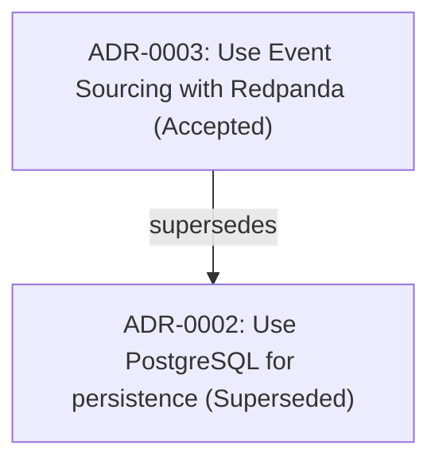

# Example: Architecture Evolution & Dependency Graph (SUPERSEDE → GRAPH)

## Scenario

As a project grows, architecture decisions evolve. In this scenario, `ADR-0002` (PostgreSQL) is superseded by `ADR-0003` (Event Sourcing with PostgreSQL & Redpanda). The project lead marks `ADR-0002` as superseded and exports deterministic Mermaid (`relationships.mmd`) and SVG (`relationships.svg`) graph artifacts to visualize decision lineages across the repository.

## Input

```bash
# 1. Supersede ADR-0002 with ADR-0003
python skills/adr-toolkit/scripts/adr.py supersede 2 --by 3 --dir docs/decisions --json

# 2. Export Mermaid and SVG relationship graph artifacts
python skills/adr-toolkit/scripts/adr.py graph --dir docs/decisions --format both --json

# 3. Update index (automatically embeds Mermaid graph in README.md)
python skills/adr-toolkit/scripts/adr.py index --dir docs/decisions --json
```

## What Happens

1. `supersede` validates the status transition, updates `ADR-0002` frontmatter status to `superseded` with `superseded_by: ADR-0003`, and adds `supersedes: ADR-0002` to `ADR-0003`.
2. `graph` parses `supersedes` and `related` relationships from all ADRs, writing deterministic `docs/decisions/relationships.mmd` (Mermaid) and `docs/decisions/relationships.svg` (Python-rendered SVG, crisp on zoom with zero external dependencies).
3. `index` regenerates `docs/decisions/README.md` and embeds the Mermaid navigation graph directly into the Markdown index.

## Output

### 1. Supersede Command Output

```json
{
  "ok": true,
  "operation": "supersede",
  "dry_run": false,
  "updated": [
    "docs/decisions/0002-use-postgresql-for-persistence.md",
    "docs/decisions/0003-use-event-sourcing-with-redpanda.md"
  ],
  "old_id": "ADR-0002",
  "new_id": "ADR-0003",
  "warnings": []
}
```

### 2. Graph Export Command Output

```json
{
  "ok": true,
  "operation": "graph",
  "format": "both",
  "artifacts": [
    "docs/decisions/relationships.mmd",
    "docs/decisions/relationships.svg"
  ],
  "edges_count": 1,
  "warnings": []
}
```

### 3. Generated Mermaid Diagram (`docs/decisions/relationships.mmd`)


