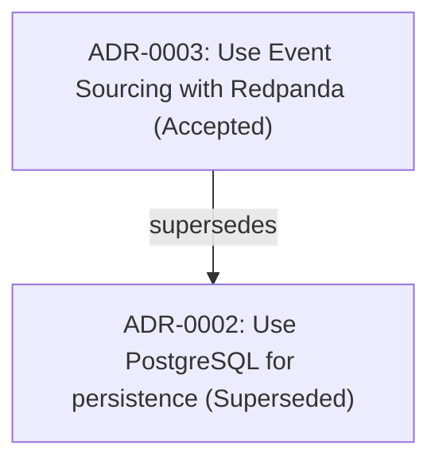

# 예시: 아키텍처 진화 및 관계 그래프 (SUPERSEDE → GRAPH)

## 시나리오 (Scenario)

프로젝트가 성장함에 따라 기존 아키텍처 결정이 새로운 기술로 대체될 수 있습니다. 본 시나리오에서는 단일 데이터베이스 구성인 `ADR-0002` (PostgreSQL)가 `ADR-0003` (PostgreSQL & Redpanda 기반 이벤트 소싱)으로 대체됩니다. 리드는 `ADR-0002`를 대체됨(`superseded`) 상태로 전환하고, Mermaid(`relationships.mmd`) 및 SVG(`relationships.svg`) 의사결정 관계 그래프를 내보내어 아키텍처 계보를 시각화합니다.

## 입력 (Input)

```bash
# 1. ADR-0002를 ADR-0003으로 대체 (Supersede)
python skills/adr-toolkit/scripts/adr.py supersede 2 --by 3 --dir docs/decisions --json

# 2. Mermaid 및 SVG 관계 그래프 아티팩트 내보내기
python skills/adr-toolkit/scripts/adr.py graph --dir docs/decisions --format both --json

# 3. 색인 문서 재생성 (README.md에 Mermaid 그래프 자동 삽입)
python skills/adr-toolkit/scripts/adr.py index --dir docs/decisions --json
```

## 동작 방식 (What Happens)

1. `supersede` 명령이 상태 전환 규칙을 검증하고 `ADR-0002` 메타데이터를 `superseded`로 변경하며 `superseded_by: ADR-0003`을 추가하고, `ADR-0003`에 `supersedes: ADR-0002` 상호 참조를 기록합니다.
2. `graph` 명령이 모든 ADR의 대체 및 관련 참조를 분석하여 결정 다이어그램인 `docs/decisions/relationships.mmd` (Mermaid) 및 외부 브라우저/Node 의존성 없이 선명하게 축적되는 `docs/decisions/relationships.svg` (Python 렌더링 SVG) 아티팩트를 자동 생성합니다.
3. `index` 명령이 `docs/decisions/README.md` 색인 문서를 재생성하면서 Mermaid 다이어그램을 색인 상단에 자동으로 포함시킵니다.

## 출력 결과 (Output)

### 1. 대체(Supersede) 처리 결과

```json
{
  "ok": true,
  "operation": "supersede",
  "dry_run": false,
  "updated": [
    "docs/decisions/0002-use-postgresql-for-persistence.md",
    "docs/decisions/0003-use-event-sourcing-with-redpanda.md"
  ],
  "old_id": "ADR-0002",
  "new_id": "ADR-0003",
  "warnings": []
}
```

### 2. 관계 그래프 생성 결과 (`graph`)

```json
{
  "ok": true,
  "operation": "graph",
  "format": "both",
  "artifacts": [
    "docs/decisions/relationships.mmd",
    "docs/decisions/relationships.svg"
  ],
  "edges_count": 1,
  "warnings": []
}
```

### 3. 생성된 Mermaid 다이어그램 (`docs/decisions/relationships.mmd`)


